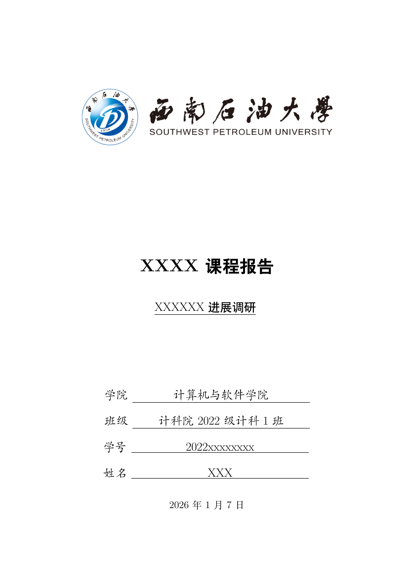
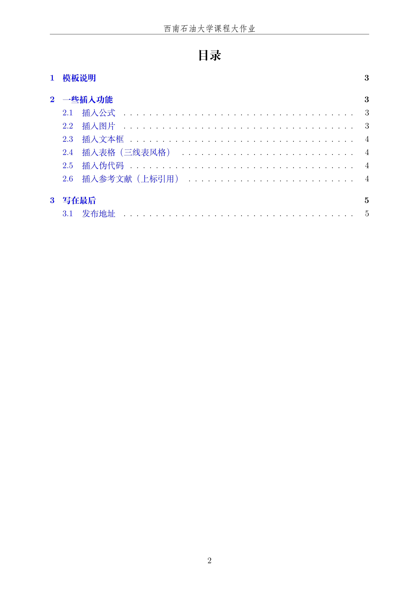
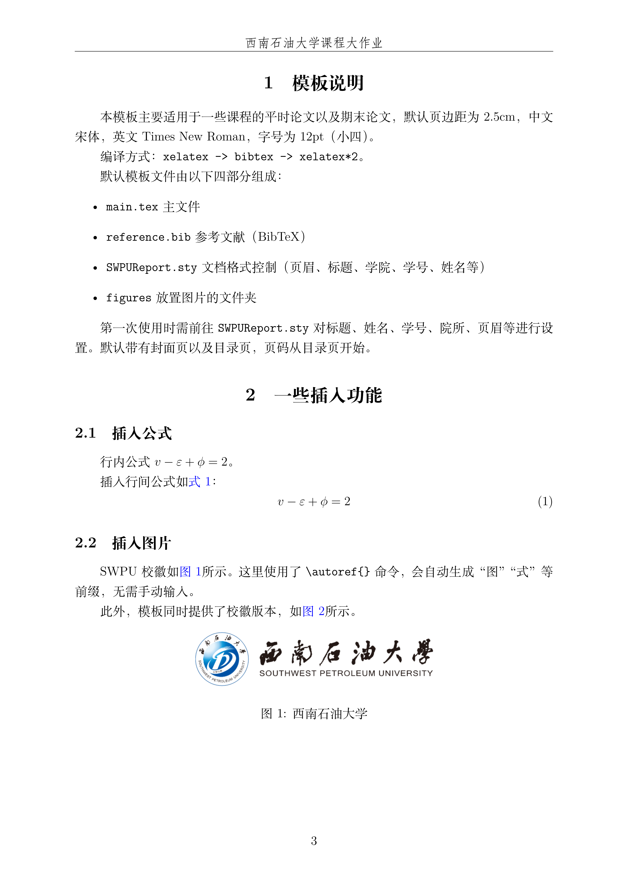
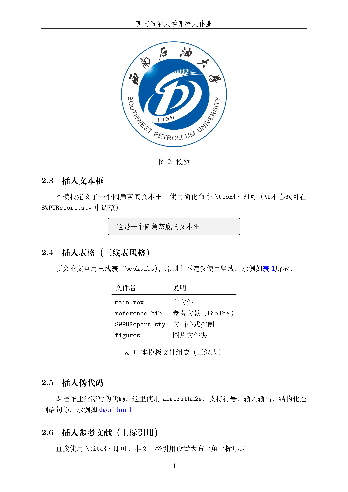
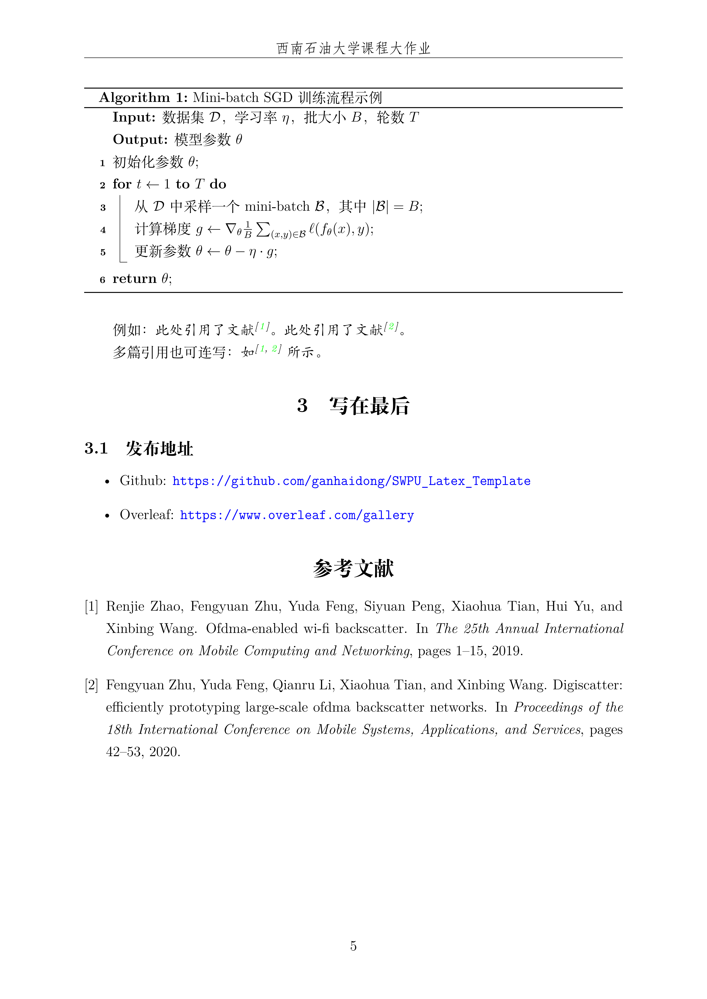

<h1 align="center">
  

   
  西南石油大学通用课程大作业及论文模板

</h1>

  Latex Template for SWPU Report

## 介绍
- 用于西南石油大学(SWPU)课程大作业/结课汇报的通用简易Latex模板

## 模板下载

* 页面右边点击：**Clone or download -> Download Zip**
* 已经上传至Overleaf模板，开箱即用 ☞ [Overleaf](https://www.overleaf.com/gallery)

## 使用方法
默认模板文件由以下四部分组成：

- `main.tex` 主文件,包含报告正文
- `reference.bib` 参考文献列表
- `UCASReport.sty` 文档格式控制，包括一些基础的设置，可以设置页眉、标题、姓名等
- `figures` 放置图片的文件夹,包含院校LOGO和效果预览图

使用时需前往`SWPUReport.sty` 对标题、副标题、姓名、学号、院所、页眉等进行设置，然后编辑`main.tex`进行正文编写

--------- 
 **强烈推荐使用[Overleaf](https://www.overleaf.com/gallery)**   模板已上传，打开即用

---------

## 模板效果展示

| 封面效果图 | 目录效果图 |
|:---:|:---:|
|  |  |

| 正文示例一 | 正文示例二 | 正文示例三 |
|:---:|:---:|:---:|
|  |  |  |

## 致谢参考
+ [国科大通用课程大作业模板LaTeX模板](https://github.com/jweihe/UCAS_Latex_Template?tab=readme-ov-file)

